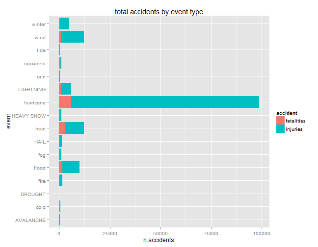

# Preliminary analysis on the outcomes of weather events in U.S.A.


## Synopsis

Storms and other severe weather events can cause both public health and economic problems for communities and municipalities. Many severe events can result in fatalities, injuries and property damage, and preventing such outcomes to the extent possible is a key concern.

The currect analysis is based on the U.S. National Oceanic and Atmospheric Administration's (NOAA) storm database. [Storm Data ](https://d396qusza40orc.cloudfront.net/repdata%2Fdata%2FStormData.csv.bz2)

This database tracks characteristics of major storms and weather events in the United States, including when and where they occur, as well as estimates of any fatalities, injuries, and property damage. The events in the database start in the year 1950 and end in November 2011. 

For the current study I haven't used many relevant information the database contains. In particular information about the distribution of events on the different States and variability in time ( 60 years ) are not included.

**Main issue of the present analysis** has been to manage the  **one thousand different event types**. Many are redundant, having very similar definition. 

After several attempt a strategy has been applied to manage it.

Conclusions of this preliminary study show that in USA in the period 1950 - 2011:  

1.  **Strong winds and Hail are the events most recurrent**;

2.  **Hurricanes and high temperature are the most dangerous for health**;

3.  **Floods and hurricanes are the most devasting for economy**.

Each of the three figures show the top events for the three different points (frequency, health_damages, economic_loss). 

It could help to prioritize resources for different types of events.

    
    
## Data Processing 
 
Storm Data file is downloaded from the NOAA site, loaded and a limited number of columns are selected.


```r
url<- 'https://d396qusza40orc.cloudfront.net/repdata%2Fdata%2FStormData.csv.bz2'

if(!file.exists('~/GitHub/Storm_NOOA/data/stormdata.csv.bz2')){
 download.file(url,'~/GitHub/Storm_NOOA/data/stormdata.csv.bz2',method='internal')
 }

 SD <- read.csv('~/GitHub/Storm_NOOA/data/stormdata.csv.bz2', stringsAsFactors = F)
 
str(SD)
names(SD)

rel_cols = c("EVTYPE", "BGN_DATE", "STATE", "FATALITIES", "INJURIES", "PROPDMG",     "PROPDMGEXP", "CROPDMG", "CROPDMGEXP")

SD_clean <- SD[, which(names(SD) %in% rel_cols)]

str(SD_clean)
dimclean<-dim(SD_clean)[1]

SD_clean$BGN_DATE <- as.Date(SD_clean$BGN_DATE, "%m/%d/%Y ")
SD_clean$BGN_DATE <- format (SD_clean$BGN_DATE, "%Y")
```


 
The dataset contains **902297** observations.

The columns relevant to my research question are:

* EVTYPE (event type, e.g. "TORNADO")
* FATALITIES (# of fatalities)
* INJURIES (# of injuries)
* PROPDMG (property damage in USD)
* PROPDMGEXP (PROPDMG magnifier, e.g. "M" for "millions")
* CROPDMG (crop damage in USD)
* CROPDMGEXP (CROPDMG magnifier, e.g. "M" for "millions")

I took also, as preliminary subset, STATE (the US state where the event occurred)  and  BGN_DATE (date of the event) is case there would need for conditional analysis.

My analysis is intended to identify the **event type with top ranking values** for the **four result variables**:

* total number of fatalities,
* total number of injures,
* total sum of damages,
* total sum of loss in crops.

The figures for economic damage require a multiplier, supplied as a set of characters. Multiplier is converted to exponential and  applied to economic damages.


```r
SD_clean$PROPDMGEXP <-as.factor(SD_clean$PROPDMGEXP)
SD_clean$CROPDMGEXP <-as.factor(SD_clean$CROPDMGEXP)

levels(SD_clean$PROPDMGEXP)
levels(SD_clean$CROPDMGEXP)

conversion_factor = list(`0` = c("", "-", "?", "+", "0"),
                    `1` = "1", 
                    `2` = c("2", "h", "H"),
                    `3` = c("3", "K", "k"), 
                    `4` = "4", 
                    `5` = "5", 
                    `6` = c("6", "M", "m"),
                    `7` = "7",
                    `8` = "8",
                    `9` = c("9","B", "b"))

levels(SD_clean$PROPDMGEXP) <- conversion_factor
levels(SD_clean$CROPDMGEXP) <- conversion_factor

table(SD_clean$PROPDMGEXP)
table(SD_clean$CROPDMGEXP)


SD_clean$PROPDMG <- SD_clean$PROPDMG * (10^(as.integer(as.character(SD_clean$PROPDMGEXP))))
SD_clean$CROPDMG <- SD_clean$CROPDMG * (10^(as.integer(as.character(SD_clean$CROPDMGEXP))))

summary(SD_clean$PROPDMG)
summary(SD_clean$CROPDMG)

levtype<-length(unique(SD$EVTYPE))
```

As already mentioned EVTYPE (which means the type of events occurred) has **985 different values**.

Some attempts is made to check if any semplification is feasible.


```r
headevents<-head(sort(table(SD_clean$EVTYPE), decreasing=TRUE), n=30)
kevents<-names(headevents)
headevents
kevents
sumh<-sum(headevents)

per30obs<-round ((sumh/dimclean)*100,1) # 97% obs in first 20 labels
```


My **research question** is  how to **deal with the error** introduced by **mispelling** in the descriptions that actually corresponds to the same event type?

I see that the sum of the first most recurrent 30 EVTYPE comprises  **97.9**% of all observations. BUT may I say that those 30 key event value (by frequency) are present as top ranking values of the four variables of my analysis?

Before addressing a time consuming re-edit of all EVTYPE, by using regular expressions, in order to obtain a limited number of event type, I have identified a clear strategy:

* take the 30 top EVTYPE for each of  the four result variables;

* merge them in a single vector of top EVTYPE;

* re-edit the top EVTYPE in order to obtain a limited number of event type


```r
library (plyr)

# first summarise the four result variables for each EVTYPE

SDxx<-ddply(SD_clean, .(EVTYPE), summarise,
            nobs= length(EVTYPE),
            qFA= sum(FATALITIES),
            qIN= sum(INJURIES),
            qPR= sum(PROPDMG),
            qCR= sum(CROPDMG)    
)

str(SDxx)

SDxx<- SDxx[order(SDxx$qFA, decreasing = T),]
hFA<-SDxx[1:30,1]

SDxx<- SDxx[order(SDxx$qIN, decreasing = T),]
hIN<-SDxx[1:30,1]

SDxx<- SDxx[order(SDxx$qPR, decreasing = T),]
hPR<-SDxx[1:30,1]

SDxx<- SDxx[order(SDxx$qCR, decreasing = T),]
hCR<-SDxx[1:30,1]

nkevents<-unique (append (hFA, append(hIN,append(hPR, hCR))))


kkevents<-unique (append (nkevents, kevents))
kkevents<-kkevents [order(kkevents)]
ltevents<- length(kkevents)
```

After step 1 and 2 I obtain **61** different EVTYPE. 

The editing of EVTYPE aggregates similar event types, obtaining a new EVTYPE domain:


```r
kevent_tranf <- list( "heat"=c(8,12,23,24),
                      "hurricane" = c(31,32,33,34,48,49,50,53),
                      "cold" =c(3,4,10,11,18,19,20),
                      "wind" = c(29,30,45,46,47,51,52,42),
                      "rain" = c(25,26),
                      "fog" = c(5,17),
                      "waterspour" = c(55,21),
                      "tide" = c(43,44,28),
                      "ripcurrent" = c(39,40),
                      "flood" =c(13,14,15,16,41,54),
                      "winter" =c(2,35,59,60,61),
                      "marinestorm" =c(37,38),
                      "fire" = c(56,57,58))

sapply(kevent_tranf, function(x) kkevents[x])
```

```
## $heat
## [1] "EXCESSIVE HEAT" "EXTREME HEAT"   "HEAT"           "HEAT WAVE"     
## 
## $hurricane
## [1] "HURRICANE"                  "HURRICANE ERIN"            
## [3] "HURRICANE OPAL"             "HURRICANE/TYPHOON"         
## [5] "TORNADO"                    "TORNADOES, TSTM WIND, HAIL"
## [7] "TROPICAL STORM"             "TYPHOON"                   
## 
## $cold
## [1] "COLD/WIND CHILL"         "DAMAGING FREEZE"        
## [3] "EXTREME COLD"            "EXTREME COLD/WIND CHILL"
## [5] "FREEZE"                  "FROST"                  
## [7] "FROST/FREEZE"           
## 
## $wind
## [1] "HIGH WIND"           "HIGH WINDS"          "STRONG WIND"        
## [4] "THUNDERSTORM WIND"   "THUNDERSTORM WINDS"  "TSTM WIND"          
## [7] "TSTM WIND/HAIL"      "SEVERE THUNDERSTORM"
## 
## $rain
## [1] "HEAVY RAIN"                "HEAVY RAIN/SEVERE WEATHER"
## 
## $fog
## [1] "DENSE FOG" "FOG"      
## 
## $waterspour
## [1] "WATERSPOUT"   "FUNNEL CLOUD"
## 
## $tide
## [1] "STORM SURGE"      "STORM SURGE/TIDE" "HIGH SURF"       
## 
## $ripcurrent
## [1] "RIP CURRENT"  "RIP CURRENTS"
## 
## $flood
## [1] "FLASH FLOOD"          "FLOOD"                "FLOOD/FLASH FLOOD"   
## [4] "FLOOD/RAIN/WINDS"     "RIVER FLOOD"          "URBAN/SML STREAM FLD"
## 
## $winter
## [1] "BLIZZARD"           "ICE STORM"          "WINTER STORM"      
## [4] "WINTER WEATHER"     "WINTER WEATHER/MIX"
## 
## $marinestorm
## [1] "MARINE THUNDERSTORM WIND" "MARINE TSTM WIND"        
## 
## $fire
## [1] "WILD FIRES"       "WILD/FOREST FIRE" "WILDFIRE"
```

This editing bring a very limited number of EVTYPE.


```r
# I made some controls of editing: duplicate, missing ....

length(names(kevent_tranf))

mylist<-c() 

for (i in names(kevent_tranf))
{
  mylist<-append(mylist, kevent_tranf[[i]])
}

length(mylist)

kkevents [!kkevents%in%kkevents[mylist]]

mylist[duplicated (mylist)] 

kkevents_post <- kkevents

for (i in 1:length(names(kevent_tranf))){
  
  ivents<-kkevents[kevent_tranf[[i]]]
  kkevents_post [kkevents %in% ivents ]<-names (kevent_tranf[i])
}

postevents<-unique(kkevents_post)
lpostevents<- length(postevents)
```


I obtain **20** new key event types.


Now I can go to the final part: calculate and plot the four result variables.
My  approach is:

* take the 10 top EVTYPE for each of  the four result variables;

* merge them in a single data frame of top EVTYPE;

* produce three plots.


```r
# re-edit the basic dataset with new EVTYPE

for (i in 1:length(names(kevent_tranf))){
  
  ivents<-kkevents[kevent_tranf[[i]]]
  SD_clean$EVTYPE [SD_clean$EVTYPE %in% ivents ]<-names (kevent_tranf[i])
}

# summarize by EVTYPE

SDET<-ddply(SD_clean, .(EVTYPE), summarise,
            nobs= length(EVTYPE),
            qFA= sum(FATALITIES),
            qIN= sum(INJURIES),
            qPR= sum(PROPDMG),
            qCR= sum(CROPDMG)    )

## take first top results 

SDET<- SDET[order(SDET$qFA, decreasing = T),]
topFA<-SDET[1:10,1]


SDET<- SDET[order(SDET$qIN, decreasing = T),]
topIN<-SDET[1:10,1]

SDET<- SDET[order(SDET$qPR, decreasing = T),]
topPR<-SDET[1:10,1]

SDET<- SDET[order(SDET$qCR, decreasing = T),]
topCR<-SDET[1:10,1]


topevents<-unique (append (topFA, append(topIN,append(topPR, topCR))))

topevents<-topevents [order(topevents)]
ltopevents <- length(topevents)

# build up the dataset for plots

topSD<-SDET[SDET$EVTYPE%in%topevents,]

l1<-topSD[,c(1,2,3)]
l2<-topSD[,c(1,2,4)]
l3<-topSD[,c(1,2,5)]
l4<-topSD[,c(1,2,6)]

l1 <- cbind(l1, accident=c("F"))
l2 <- cbind(l2, accident=c("I"))
colnames(l1)<-c("event","n.events","n.accidents","accident")
colnames(l2)<-c("event","n.events","n.accidents","accident")
l12<-rbind(l1,l2)
l12<-l12[order (l12$event),]

l3 <- cbind(l3, damage=c("P"))
l4 <- cbind(l4, damage=c("C"))
colnames(l3)<-c("event","n.events","tot.damage","damage")
colnames(l4)<-c("event","n.events","tot.damage","damage")
l34<-rbind(l3,l4)
l34<-l34[order (l34$event),]

SDfinal<-cbind(l12,l34)
SDfinal<-SDfinal[order(SDfinal$event),]

SDfinal<-SDfinal[,c(-5,-6)]

colnames(SDfinal)<-c("event","nevents",
                     "n.accidents","accident",
                     "tot.damage","damage")

SDfinal$accident <-as.factor(SDfinal$accident)
SDfinal$damage <-as.factor(SDfinal$damage)

levels(SDfinal$accident) <- c("fatalities", "injuries")
levels(SDfinal$damage) <- c("properties", "crops")

head (SDfinal)
```

The dataset for plotting, containing **16** top events,  looks like that 


```r
head (SDfinal)
```

```
##         event nevents n.accidents   accident tot.damage     damage
## 19  AVALANCHE     386         224 fatalities  3.722e+06 properties
## 191 AVALANCHE     386         170   injuries  0.000e+00      crops
## 64       cold    3671         382 fatalities  9.608e+07 properties
## 641      cold    3671         270   injuries  3.162e+09      crops
## 92    DROUGHT    2488           0 fatalities  1.046e+09 properties
## 921   DROUGHT    2488           4   injuries  1.397e+10      crops
```


## Preliminary Results 


In order to give a preliminary orientation about outcomes of the most important Natural Events that have been occurred in U.S.A. between 1950 and 2011 three are the key plot produced three are the plots.

The first gives an overview about the total numbers of events.

It helps understanding what are the most frequent events.


```r
library (ggplot2)

ggplot( SDfinal, aes(x=event, y=nevents/2000, fill=event) ) +
    geom_bar(stat="identity", show_guide = F  ) + coord_flip() +
    ggtitle("total number of event by type")  + 
    xlab("event") + ylab( "total number in thousands") 
```

 

The second gives an overview about which types of events are most harmful with respect to population health, showing the total sum of fatalities and injuried people by event.

It helps understanding what are the most dangerous events.


```r
SDfinal<- SDfinal[order(SDfinal$accident),]

ggplot( SDfinal, aes(x=event, y=n.accidents, fill=accident ) ) +
    geom_bar(stat="identity" ) + coord_flip() +
    ggtitle("total accidents by event type")  
```

 

The third gives an overview about which types of events have the greatest economic consequences, showing the total losses in properties and crop by event.

It helps understanding what are the most devasting events.


```r
SDfinal<- SDfinal[order(SDfinal$damage),]

ggplot( SDfinal, aes(x=event, y=tot.damage/1000000000, fill=damage ) ) +
    geom_bar(stat="identity" ) + coord_flip() +
    ggtitle("total damages by event type")  + 
    xlab("event") + ylab( "in Bl. dollars")
```

 


Conclusions of this preliminary study show that in USA in the period 1950 - 2011:  

1.  **Strong winds and Hail are the events most recurrent**;

2.  **Hurricanes and high temperature are the most dangerous for health**;

3.  **Floods and hurricanes are the most devasting for economy**.

Each of the three figures shows the top events for the three different points (frequency, health_damages, economic_loss). 

It could help to prioritize resources for different types of events.


